# GostFrame
<p align="center">
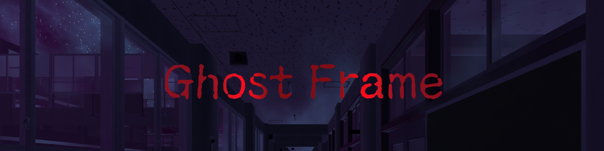
</p><br/>
河原電子ビジネス専門学校　ゲームクリエイター科　2年<br/>
氏名：阿部　匠<br/>
<br/>

# 作品概要
- タイトル<br/>
   - Ghost Frame
 - 制作人数<br/>
   - 1人
 - 制作期間
   - 2024年9月～現在
 - ゲームジャンル
   - 3Dホラー風FPSゲーム
 - プレイ人数
   - 1人
 - 使用言語
   - C#
 - 使用ツール
   - Unity
   - Visual Studio 2022
   - Visual Studio Code
   - Adobe Photoshop 2024


## ゲーム説明
夜の廃校となった小学校が舞台のホラー風FPSゲームです。<br/>
学校内では幽霊がさまよっておりプレイヤーを攻撃してきます。<br/>
プレイヤーはカメラを使用して幽霊のいる学校からの脱出を目指します。<br/>

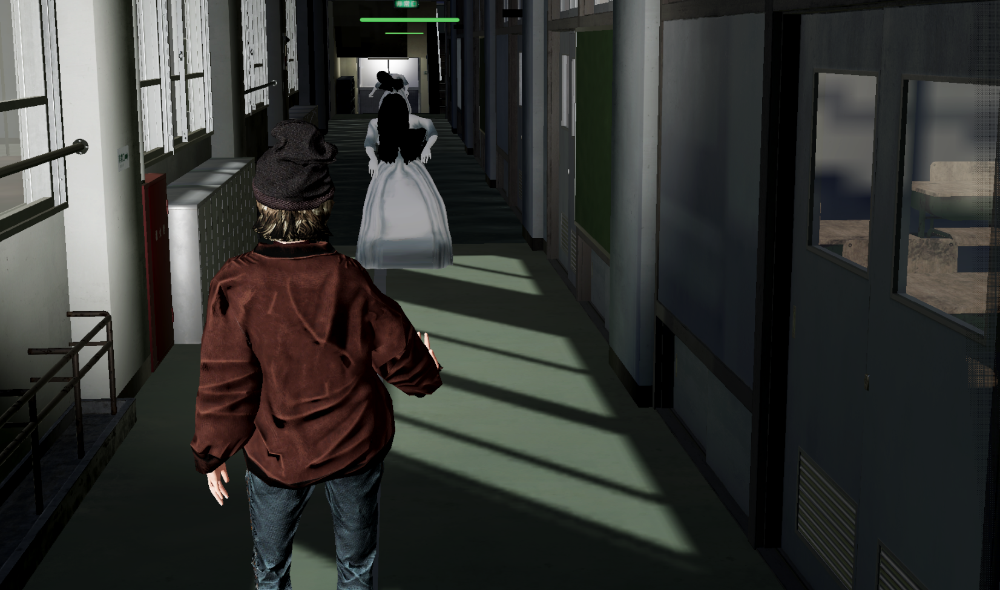<br>
</p>

黒板には脱出のヒントが書かれています。<br/>
一部の漢字が未対応のフォントであったのと小学校であるためヒントは子供っぽくなるよう一部ひらがなで書きました。<br/>


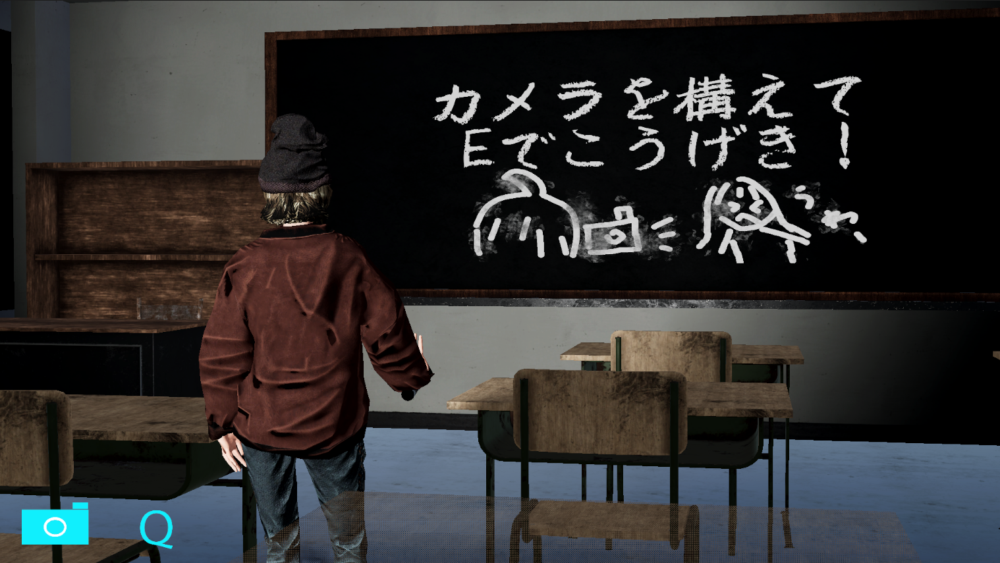<br>
</p>

### ゲーム内ギミック
ゲーム内にあるギミック
1. 幽霊<br/>
   - プレイヤーに対して攻撃してくるエネミーです。プレイヤーを発見すると近づいてきて攻撃してきます。<br/>
   - プレイヤーはカメラを使って幽霊を写真に取ることによって相手にダメージを与えることができます。<br/>
   - 顔を写さないとダメージが与えられないようになっています。
<br/>

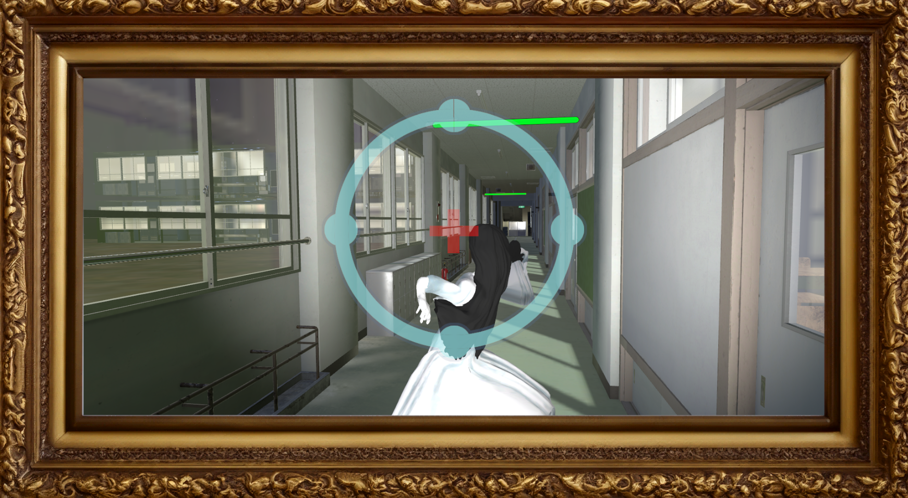<br>
</p>

1. 勾玉<br/>
   - 学校内に設置されている勾玉を壊すと霧でふさがれている通路の通行が可能になります。
   <br/>
   - 勾玉を壊すには後述する攻撃を最大までチャージしないと壊せないようになっています。
   <br/>
   
   <!-- 勾玉を壊すgifを挿入 -->

<br>
</p>

<!-- テスト用コメント
1. テスト
```json
プログラミングコードはここに書く

```
- てすと
- てすと１
- てすと２

|名前|説明|
|---|---|
|SSR|スクリーンスペースでの反射アルゴリズム|
|Decal|テクスチャを貼り付ける処理| -->

### プレイヤーについて
プレイヤーは下記の方法で操作ができます。

|キー|説明|
|---|---|
|WASD|移動|
|↑↓←→|視点移動|
|Shift|カメラを構えていない時：ダッシュ|
|Q|カメラを構える：カメラを離す|
|E|カメラを構えている時：シャッターを切る <br/> カメラを構えていない時：ドアを開ける|


プレイヤーやカメラの状態はステートで管理しています。
通常時はカメラは3人称視点となります。<br/>
カメラを構えている時は1人称視点となり、できるアクションが異なります。<br/>
カメラを構えている時はダッシュとドアを開けることができなくなり、カメラのシャッターを切ることで攻撃することができるようになります。<br/>
攻撃にはフェイタル攻撃というものがあり、エネミーの攻撃直前のタイミングで攻撃チャージが最大になるカウンター攻撃と最大チャージ攻撃時の追加攻撃のチャンスがあります。<br/>

### エネミーについて
エネミーもステートで管理しています。

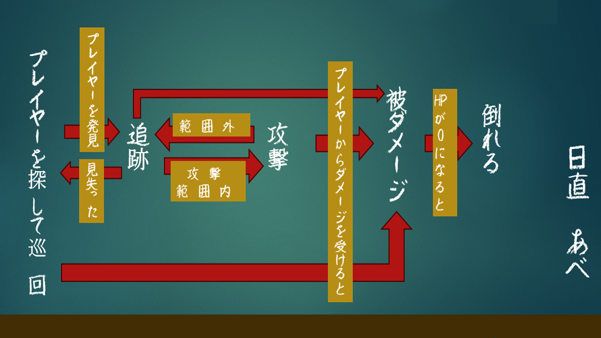<br>
エネミーのステート管理
</p>

## 使用した技術
ゲーム内で使用した技術は下記になります。<br/>
- ディザリング<br/>
- ナビメッシュ<br/>
- Unitask<br/>
- デカール<br/>
- Air Sticker<br/>

### ディザリング
カメラとプレイヤーの間にオブジェクトが存在するとプレイヤーが見えなくなってしまう現象が発生しました。<br/>
そこでシェーダーにディザリングを組み込むことによってオブジェクトがカメラに近づくと徐々に見えなくなっていき、遠いとはっきり見えるように改良しました。<br/>

   <!-- ディザリングのオン、オフの画像を挿入 -->

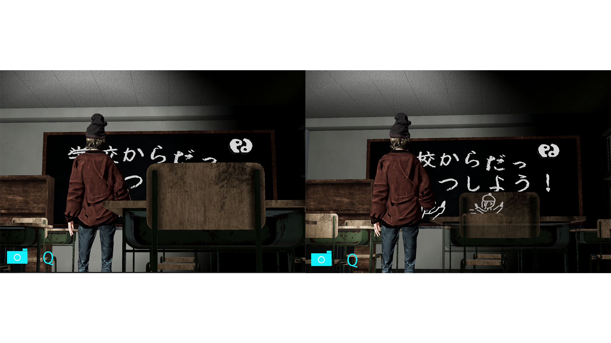<br>
</p>

### ナビメッシュ
エネミーの挙動はナビメッシュを使いました。<br/>
巡回用のポインタを置き、ポインタに近づくと別のポインタに向かって歩く処理を実現しました。<br/>
プレイヤーが近づいた場合、プレイヤーコリジョンタグを持ったものがサーチ用の敵のコリジョンに接触することによって、
ナビメッシュの目標をプレイヤーに変更することができました。


</p>

 ### Unitask
 Unitaskを使って非同期処理でシーン切り替えやUI表示のディレイなどを実装しました。<br/>
 
 ```json
     async UniTask LoadScene(string sceneName)
    {
        await SceneManager.LoadSceneAsync(sceneName).ToUniTask();
    }
 ```    

  <!-- UnitaskでのUI表示を挿入 -->

<br>
</p>

 ### デカール
 チュートリアル用の説明を黒板に表示させる為にデカールを使いました。<br/>
 デカールを使うことによって黒板に書かれている文字や絵がちゃんと黒板に書かれているように見せることができました。

<br>
</p>

 ### Air Sticker
 デカールを使うにあたって2つの問題が出てきました。<br/>
 この2つの問題を解決するためにOSSのAirStickerを使いました。<br/>
 AirStickerはデカールの処理対象を絞ることによって処理を軽減することができるシステムです。<br/>

 問題の1つ目はプレイヤーがデカールの範囲内に入るとプロジェクターのようにプレイヤーにもデカールの文字が写ってしまいました。
 AirStickerはデカールを受けるレシーバーオブジェクトを指定することができ黒板にのみ表示させることができました。

  <!-- AirStickerのオン、オフの画像を挿入 -->

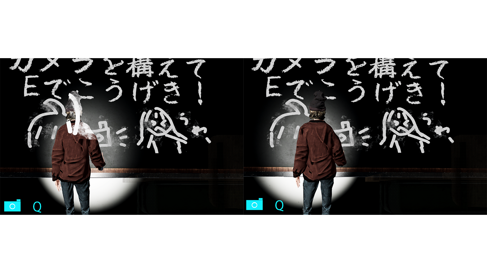<br>
</p>

2つ目は窓などの遮蔽物があるとディザリングの透過処理で見ることができませんでした。<br/>

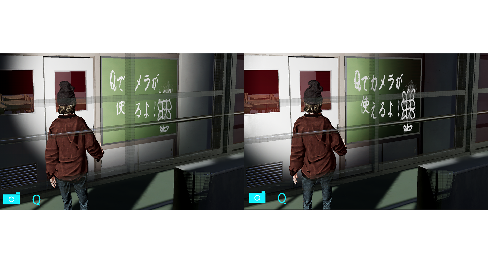<br>
左：AirSticker適用前　右：AirSticker適用後
</p>

これはUnityのデカールは下記の図のようにDepthNormalPrepassで作成された深度情報を元にデカールを貼り付けるからです。

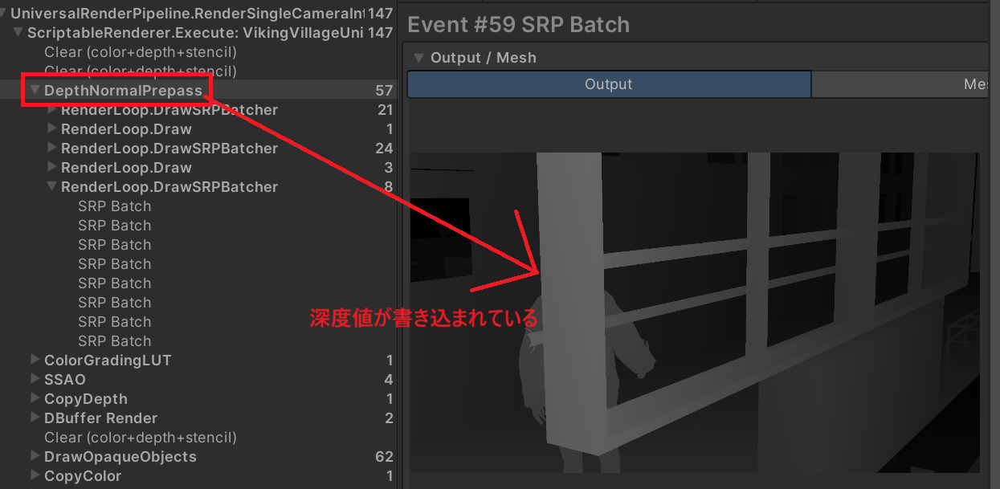<br>
DepthNormalPrepass
</p>

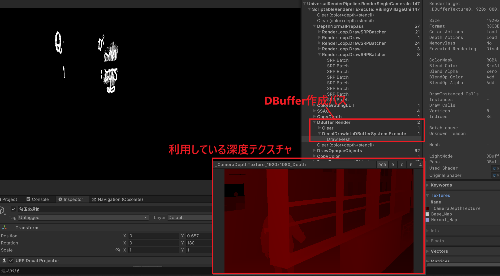<br>
D-BufferRender
</p>

一方、AirStickerはメッシュを生成するデカールとなっていて、Unityのデカールの特殊な処理と異なり普通のモデル描画です。<br/>
このようにAirStickerを利用することで、通常の背景と同じようにデカールを描画できるためこの問題を解決することができました。<br/>


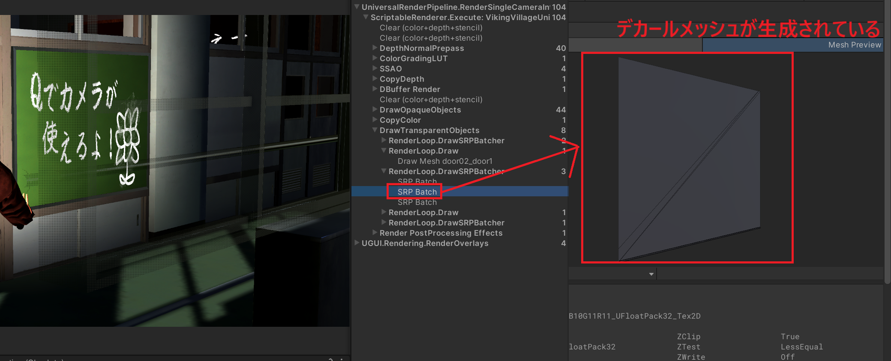<br>
</p>

 <!--(※想定されるツッコミ・DepthNormalPrepassでディザ抜きすれば解決すると思うのですが、それを採用しなかった理由は何ですか？
　DepthNormalPrepassでディザ抜きをする方法が分からなかったのと、Air Stickerを使えば解決できることが分かっていたのでこの方法にしました。
　ただ、この問題自体はこれで解決しているのですが、深度情報が正しくないと被写界深度などの深度情報を使う処理もおかしくなるということが分かっているので、今後の改善として考えています。
なぜAirStickerを知っていたのか？教えていただいている講師の方が作ったOSS（オープンソースソフトウェア）の１つとして紹介されていたのを覚えていた) -->

